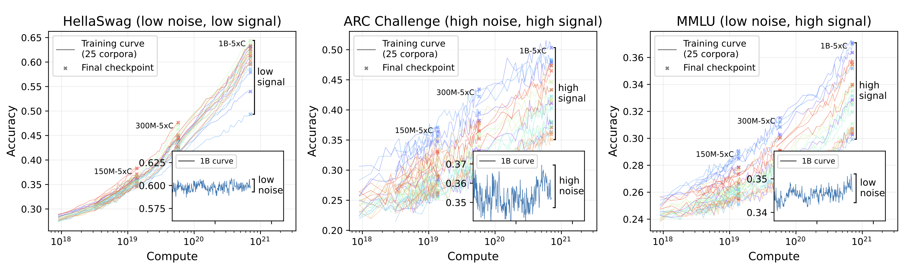

# Title

!!! note Notes

!!! tip Tips

!!! warning Warnings

??? info "show"
    ABCDEFG

<figure>
  
  <figcaption>그림 1. 테스트 이미지 설명</figcaption>
</figure>


:smile:   :rocket:   :material-github:   :fontawesome-solid-user:

```python
from transformers import AutoModelForCausalLM

model = AutoModelForCausalLM.from_pretrained("abc")
```


# Material 색상 변수 미리보기

<style>
  .color-swatch {
    display: grid;
    grid-template-columns: repeat(auto-fill, minmax(180px, 1fr));
    gap: 1rem;
  }
  .color-swatch div {
    border: 1px solid var(--md-default-fg-color--lighter);
    border-radius: 6px;
    padding: 0.5rem;
    text-align: center;
    font-size: 0.8rem;
  }
  .color-swatch span {
    display: block;
    height: 40px;
    border-radius: 4px;
    margin-bottom: 0.4rem;
  }
</style>


<style>
  .swatches{display:grid;grid-template-columns:repeat(auto-fill,minmax(220px,1fr));gap:1rem}
  .swatch{border:1px solid var(--md-default-fg-color--lighter);border-radius:10px;padding:.75rem 1rem}
  .swatch .chip{display:block;height:42px;border-radius:6px;margin-bottom:.5rem}
  .label{font-size:.95rem;text-align:center;color:var(--md-default-fg-color)}
  .chip.border{outline:1px solid var(--md-default-fg-color--lightest)}
</style>

## 🔤 FG (텍스트) 컬러 변수 – currentColor 트릭
<div class="swatches">

<div class="swatch">
  <span class="chip" style="color:var(--md-default-fg-color);background:currentColor"></span>
  <div class="label">--md-default-fg-color</div>
</div>

<div class="swatch">
  <span class="chip" style="color:var(--md-default-fg-color--light);background:currentColor"></span>
  <div class="label">--md-default-fg-color--light</div>
</div>

<div class="swatch">
  <span class="chip" style="color:var(--md-default-fg-color--lighter);background:currentColor" class="border"></span>
  <div class="label">--md-default-fg-color--lighter</div>
</div>

<div class="swatch">
  <span class="chip" style="color:var(--md-default-fg-color--lightest);background:currentColor" class="border"></span>
  <div class="label">--md-default-fg-color--lightest</div>
</div>

<div class="swatch">
  <span class="chip" style="color:var(--md-primary-fg-color);background:currentColor"></span>
  <div class="label">--md-primary-fg-color</div>
</div>

<div class="swatch">
  <span class="chip" style="color:var(--md-primary-fg-color--light);background:currentColor"></span>
  <div class="label">--md-primary-fg-color--light</div>
</div>

<div class="swatch">
  <span class="chip" style="color:var(--md-primary-fg-color--dark);background:currentColor"></span>
  <div class="label">--md-primary-fg-color--dark</div>
</div>

<div class="swatch">
  <span class="chip" style="color:var(--md-accent-fg-color);background:currentColor"></span>
  <div class="label">--md-accent-fg-color</div>
</div>

<div class="swatch">
  <span class="chip" style="color:var(--md-code-fg-color);background:currentColor"></span>
  <div class="label">--md-code-fg-color</div>
</div>

</div>

## 🧱 BG (배경) 컬러 변수
<div class="swatches">

<div class="swatch">
  <span class="chip" style="background:var(--md-default-bg-color)" class="border"></span>
  <div class="label">--md-default-bg-color</div>
</div>

<div class="swatch">
  <span class="chip" style="background:var(--md-accent-bg-color)" class="border"></span>
  <div class="label">--md-accent-bg-color</div>
</div>

<div class="swatch">
  <span class="chip" style="background:var(--md-code-bg-color)" class="border"></span>
  <div class="label">--md-code-bg-color</div>
</div>

</div>

## 🌫 Shadow 변수 (box-shadow로 미리보기)
<div class="swatches">

<div class="swatch">
  <span class="chip" style="background:var(--md-default-bg-color);box-shadow:var(--md-shadow-z1)"></span>
  <div class="label">--md-shadow-z1</div>
</div>

<div class="swatch">
  <span class="chip" style="background:var(--md-default-bg-color);box-shadow:var(--md-shadow-z2)"></span>
  <div class="label">--md-shadow-z2</div>
</div>

<div class="swatch">
  <span class="chip" style="background:var(--md-default-bg-color);box-shadow:var(--md-shadow-z3)"></span>
  <div class="label">--md-shadow-z3</div>
</div>

</div>


<div class="post-meta">
  <span class="post-meta__item">👤 mjkmain</span>
</div>