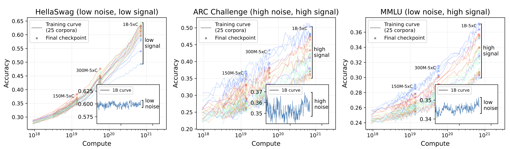

<ul class="post-cards">
  <li>
    <a href="_posts/2025-08-23-signal_and_noise/post/" class="post-card">
      

        <h3 class="title">Signal and Noise: A Framework for Reducing Uncertainty in Language Model Evaluation</h3>
        <!-- 
LLM 평가에서 불확실성을 줄이기 위한 Signal/Noise 프레임워크 핵심 정리.
 -->
      

      
    </a>
  </li>
</ul>
